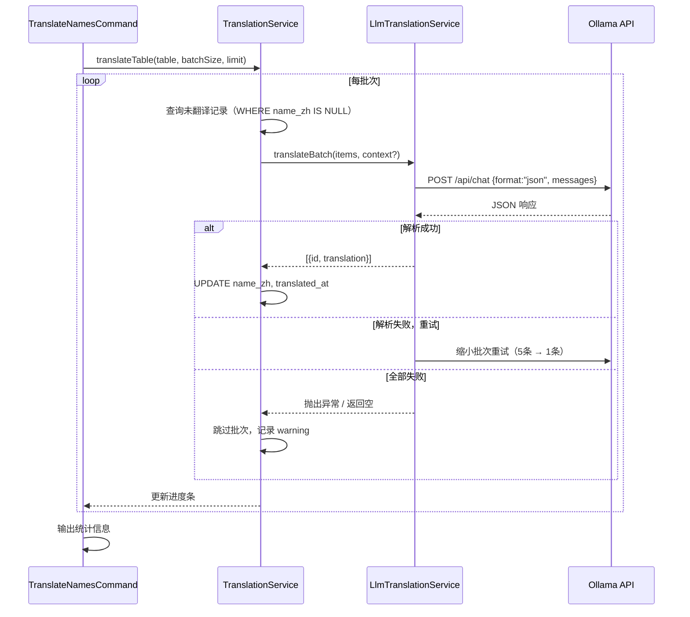

# 设计文档：LLM 翻译模块

## 概述

LLM 翻译模块通过本地部署的 Ollama（Qwen 2.5 7B）将 `departments`、`jobs`、`keywords`、`languages` 四张参考数据表的英文 `name` 字段批量翻译为中文，结果写入各表新增的 `name_zh` 字段。翻译通过 Artisan Command 手动触发，支持断点续传与容错重试。API 层在 `name_zh` 为 null 时降级返回原始英文 `name`。

本模块是对现有只读参考数据表的有限扩展写入，不改变原有数据采集流程，也不影响现有 API 的正常输出。

---

## 架构

### 整体分层

```
Artisan Command: translate:names
  └── TranslationService（按表分发、构建上下文、写入结果）
        └── LlmTranslationService（封装 Ollama HTTP 调用、容错解析）
              └── Ollama /api/chat（本地 HTTP，format: "json"）
```

### 数据流



### 与现有架构的关系

- `TranslationService` 和 `LlmTranslationService` 均放在 `app/Services/` 下
- 翻译任务写入 `name_zh` / `translated_at` 是本项目对只读表的唯一例外写入，通过 Artisan Command 触发，不经过 HTTP 层
- API Resource 层（`DepartmentResource` 等）读取 `name_zh` 字段，降级逻辑在 Resource 内处理，不影响 Service / Repository

---

## 组件与接口

### 1. TranslateNamesCommand

**位置：** `app/Console/Commands/TranslateNamesCommand.php`

**职责：** 解析命令行参数，调用 `TranslationService`，显示进度条，输出统计。

**签名：**
```
translate:names
    {--table=all : 目标表，可选值：departments|jobs|keywords|languages|all}
    {--batch-size=20 : 每批翻译条目数}
    {--limit= : 本次最多处理条目数，不指定则处理全部}
```

**核心逻辑：**
- `--table` 不在允许范围内时，输出错误并以非零状态码退出
- `--table=all` 时依次处理四张表
- 使用 Laravel `ProgressBar` 显示进度
- 任务完成后输出：成功条目数 / 失败批次数 / 跳过批次数

### 2. TranslationService

**位置：** `app/Services/TranslationService.php`

**职责：** 按表分发翻译任务，构建上下文，写入翻译结果。

**公共方法：**

```php
/**
 * Translate all untranslated records for the given table.
 * Returns stats: ['success' => int, 'skipped_batches' => int]
 */
public function translateTable(
    string $table,
    int $batchSize = 20,
    ?int $limit = null,
    ?callable $onProgress = null
): array
```

**内部逻辑：**
- `keywords` 表：`WHERE name_zh IS NULL`（断点续传）
- `departments` / `jobs` / `languages` 表：查询全部记录
- `jobs` 表：预加载关联 `department.name`，作为上下文传给 `LlmTranslationService`
- 翻译成功后批量 `UPDATE name_zh = ?, translated_at = NOW()`
- 批次被跳过时不写入任何字段，保留未翻译状态

### 3. LlmTranslationService

**位置：** `app/Services/LlmTranslationService.php`

**职责：** 封装 Ollama HTTP 调用，构造 prompt，解析响应，容错重试。

**公共方法：**

```php
/**
 * Translate a batch of items via Ollama.
 * Returns array of ['id' => int, 'translation' => string].
 * Returns empty array if all retries fail (caller should skip the batch).
 */
public function translateBatch(
    array $items,       // [['id' => int, 'text' => string], ...]
    string $tableType,  // 'departments'|'jobs'|'keywords'|'languages'
    ?string $context = null  // jobs 表传入 "电影制作职位，所属部门：Camera"
): array
```

**重试策略：**

| 尝试次数 | 批次大小 |
|---------|---------|
| 第 1 次（原始） | 传入的 batchSize |
| 第 2 次（重试 1） | 5 |
| 第 3 次（重试 2） | 1 |

全部失败时返回空数组，并记录 `Log::warning`。

### 4. API Resource 层修改

需修改以下四个 Resource，添加 `name_zh` 字段输出：

- `DepartmentResource`
- `JobResource`
- `KeywordResource`
- `LanguageResource`

**输出规则（以 DepartmentResource 为例）：**

```php
'name'    => $this->name,       // 始终输出原始英文名，不变
'name_zh' => $this->name_zh,    // null 时输出 null，非 null 时输出译文
```

> 设计决策：`name_zh` 为 null 时直接输出 null，而非降级为英文 name。降级逻辑由前端决定如何展示，API 层只负责如实输出数据状态。这与需求 2.2 一致。

### 5. 配置

**位置：** `config/services.php`（新增 `ollama` 键）

```php
'ollama' => [
    'base_url' => env('OLLAMA_BASE_URL', 'http://localhost:11434'),
    'model'    => env('OLLAMA_MODEL', 'qwen2.5:7b'),
],
```

`.env.example` 新增：
```
OLLAMA_BASE_URL=http://localhost:11434
OLLAMA_MODEL=qwen2.5:7b
```

---

## 数据模型

### 数据库变更

四张表各新增两个字段，通过独立 migration 文件添加：

| 表 | 新增字段 | 类型 | 说明 |
|----|---------|------|------|
| `departments` | `name_zh` | `varchar(255) NULL` | 中文译名 |
| `departments` | `translated_at` | `timestamp NULL` | 翻译时间，null 表示未翻译 |
| `jobs` | `name_zh` | `varchar(255) NULL` | 中文译名 |
| `jobs` | `translated_at` | `timestamp NULL` | 翻译时间 |
| `keywords` | `name_zh` | `varchar(255) NULL` | 中文译名 |
| `keywords` | `translated_at` | `timestamp NULL` | 翻译时间 |
| `languages` | `name_zh` | `varchar(255) NULL` | 中文译名 |
| `languages` | `translated_at` | `timestamp NULL` | 翻译时间 |

**Migration 文件命名：**
```
xxxx_xx_xx_000000_add_translation_fields_to_reference_tables.php
```

四张表在同一个 migration 文件中处理，减少文件数量。

### Model 变更

四个 Model 各新增 `name_zh` 和 `translated_at` 到 `$fillable`，并在 `$casts` 中声明 `translated_at` 为 `datetime`：

```php
// Department Model 示例
protected $fillable = ['name', 'name_zh', 'translated_at'];

protected $casts = [
    'translated_at' => 'datetime',
];
```

### Prompt 数据结构

**User Message 格式：**

```json
{
  "task": "translate_to_chinese",
  "context": "电影制作职位，所属部门：Camera",
  "items": [
    {"id": 1, "text": "Director of Photography"},
    {"id": 2, "text": "Camera Operator"}
  ]
}
```

`context` 字段仅 `jobs` 表翻译时携带，其他表省略。

**期望响应格式：**

```json
[
  {"id": 1, "translation": "摄影指导"},
  {"id": 2, "translation": "摄影师"}
]
```

### System Prompt 设计

```
你是一个专业的影视行业术语翻译助手，专门翻译 TMDB 数据库中的英文词条为中文。

规则：
1. 译文必须是词或短语，不能是完整句子
2. keywords/departments/languages 的译文不超过 8 个汉字
3. jobs 的译文不超过 12 个汉字
4. 保持影视行业专业性，使用业内通用译法

示例：
✗ "based on novel" → "这是一部基于小说改编的作品"
✓ "based on novel" → "小说改编"
✗ "Director of Photography" → "负责摄影工作的导演"
✓ "Director of Photography" → "摄影指导"

请严格按照 JSON 数组格式返回，不要添加任何其他文字。
```

---

## 正确性属性

*属性（Property）是在系统所有有效执行中都应成立的特征或行为——本质上是对系统应该做什么的形式化陈述。属性是人类可读规范与机器可验证正确性保证之间的桥梁。*

### 属性 1：翻译成功后 translated_at 必须非空

*对任意* 一条经过翻译写入操作的记录，操作完成后该记录的 `translated_at` 字段必须为非 null 的有效时间戳，且 `name_zh` 字段必须为非 null 的字符串。

**验证需求：1.6、5.3**

### 属性 2：Resource 输出的 name_zh 与数据库值一致

*对任意* 一条参考数据记录（departments / jobs / keywords / languages），无论其 `name_zh` 字段为 null 还是非 null，通过对应 API Resource 序列化后，响应中的 `name_zh` 字段值必须与数据库中存储的值完全一致。

**验证需求：2.1、2.2、2.4**

### 属性 3：翻译操作不修改原始 name 字段

*对任意* 一条记录，在翻译写入操作（更新 `name_zh` 和 `translated_at`）前后，其 `name` 字段的值必须保持不变。

**验证需求：2.3、2.5**

### 属性 4：翻译结果通过 id 映射，与响应顺序无关

*对任意* 一批翻译请求和对应的乱序响应，`LlmTranslationService` 解析后返回的翻译结果必须通过 `id` 字段与原始请求条目正确对应，不依赖响应数组的顺序。

**验证需求：4.5**

### 属性 5：批次跳过时不写入任何记录

*对任意* 一个全部重试均失败的批次，该批次内所有记录的 `name_zh` 和 `translated_at` 字段必须保持原值（null），不发生任何写入操作。

**验证需求：4.4、5.4**

### 属性 6：keywords 断点续传——已翻译记录不被重复处理

*对任意* 一条 `name_zh` 已非 null 的 keywords 记录，再次运行翻译任务时，该记录不会出现在查询结果中，也不会触发任何写入操作。

**验证需求：6.1、6.3**

### 属性 7：--table 参数白名单校验

*对任意* 不在 `{departments, jobs, keywords, languages, all}` 范围内的 `--table` 参数值，命令必须以非零状态码退出，且不执行任何翻译操作。

**验证需求：7.8**

### 属性 8：JSON 容错解析——从污染响应中提取有效 JSON

*对任意* 包含 markdown 代码块、前缀文字或其他文本污染的 LLM 响应字符串，只要其中存在合法的 `[...]` 或 `{...}` JSON 块，解析函数必须能成功提取并返回有效结果。

**验证需求：4.1**

### 属性 9：Ollama 不可达时抛出异常并记录日志

*对任意* 一次 `OLLAMA_BASE_URL` 对应服务不可达的调用，`LlmTranslationService` 必须抛出异常，且必须记录包含服务地址和错误信息的 error 级别日志。

**验证需求：8.3**

---

## 错误处理

### Ollama 服务不可达

- `LlmTranslationService` 使用 Laravel HTTP Client，连接失败时抛出 `\Illuminate\Http\Client\ConnectionException`
- 上层 `TranslationService` 不捕获此异常，让全局处理器接管（命令行下 Laravel 会输出错误并以非零退出）
- 记录 `Log::error`，包含 `base_url` 和异常 message

### JSON 解析失败

- 第一层防御：Ollama `format: "json"` 参数
- 第二层防御：正则提取响应中第一个 `[...]` 或 `{...}` 块
- 第三层防御：解析失败自动重试，批次大小递减（原始 → 5 → 1）
- 全部失败：跳过批次，记录 `Log::warning`，包含原始响应内容（截断至 500 字符）

### 部分翻译结果缺失

- LLM 可能返回少于请求数量的翻译条目（小模型常见问题）
- 通过 `id` 映射，只写入有对应翻译的记录，缺失的记录保持 `name_zh = null`
- 不视为错误，不触发重试

### 数据库写入失败

- 使用 `DB::transaction` 包裹每批次的批量更新
- 写入失败时事务回滚，该批次记录保持未翻译状态
- 记录 `Log::error`，包含表名、批次 ID 范围和异常信息

---

## 测试策略

### 单元测试（Unit Test）

**LlmTranslationService 测试** — `tests/Unit/Services/LlmTranslationServiceTest.php`

重点测试 JSON 容错解析逻辑（不依赖真实 Ollama，使用 `Http::fake()`）：

```
// Feature: llm-translation, Property 8: JSON 容错解析——从污染响应中提取有效 JSON
test_extracts_json_from_markdown_code_block
test_extracts_json_from_prefixed_text_response
test_extracts_json_when_wrapped_in_extra_whitespace
test_extracts_json_from_mixed_text_and_json

// Feature: llm-translation, Property 4: 翻译结果通过 id 映射，与响应顺序无关
test_maps_translations_by_id_regardless_of_order
test_maps_translations_when_response_is_reversed
test_maps_translations_with_sparse_ids

// Feature: llm-translation, Property 5: 批次跳过时不写入任何记录
test_returns_empty_array_when_all_retries_fail
test_retries_with_smaller_batch_on_parse_failure

// Feature: llm-translation, Property 9: Ollama 不可达时抛出异常并记录日志
test_throws_exception_when_ollama_unreachable
test_logs_error_with_base_url_when_connection_fails
```

**TranslationService 测试** — `tests/Unit/Services/TranslationServiceTest.php`

Mock `LlmTranslationService`，测试写入逻辑（使用 SQLite in-memory + `RefreshDatabase`）：

```
// Feature: llm-translation, Property 1: 翻译成功后 translated_at 必须非空
test_writes_name_zh_and_translated_at_on_success
test_translated_at_is_set_to_current_timestamp

// Feature: llm-translation, Property 3: 翻译操作不修改原始 name 字段
test_name_field_unchanged_after_translation

// Feature: llm-translation, Property 5: 批次跳过时不写入任何记录
test_does_not_write_when_batch_is_skipped
test_skipped_records_remain_null_after_failed_batch

// Feature: llm-translation, Property 6: keywords 断点续传
test_keywords_only_queries_untranslated_records
test_already_translated_keywords_are_not_reprocessed
```

### Feature Test（集成测试）

**API Resource 测试** — `tests/Feature/Translation/ResourceTranslationTest.php`

```
// Feature: llm-translation, Property 2: Resource 输出的 name_zh 与数据库值一致
test_department_resource_outputs_null_name_zh_when_not_translated
test_department_resource_outputs_name_zh_value_when_translated
test_job_resource_follows_same_name_zh_output_rules
test_keyword_resource_follows_same_name_zh_output_rules
test_language_resource_follows_same_name_zh_output_rules

// Feature: llm-translation, Property 3: 翻译操作不修改原始 name 字段
test_original_name_field_always_present_in_response
```

**Command 测试** — `tests/Feature/Translation/TranslateNamesCommandTest.php`

```
// Feature: llm-translation, Property 7: --table 参数白名单校验
test_exits_with_nonzero_code_for_invalid_table_option
test_invalid_table_does_not_trigger_any_translation
test_accepts_all_valid_table_options

// 具体例子测试
test_table_all_processes_all_four_tables
test_outputs_statistics_after_completion
test_respects_limit_option
```

### 测试配置说明

- 所有测试使用 SQLite in-memory + `RefreshDatabase`（需为四张参考表创建测试用 migration）
- `LlmTranslationService` 在单元测试中通过 `Http::fake()` 模拟 Ollama 响应，不连接真实服务
- 每个属性测试通过 `@dataProvider` 覆盖至少 5 组不同输入
- 标注格式：`// Feature: llm-translation, Property {N}: {property_text}`
