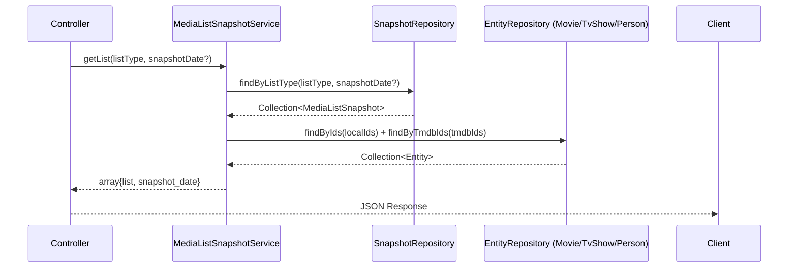

# 技术设计文档：Media List Snapshots

## 概述

本模块为 Filmly Management Backend 提供 TMDB 榜单快照数据的只读 API 接口。`media_list_snapshots` 表由独立采集项目写入，本模块在此基础上提供 10 个榜单接口（4 个电影榜单、4 个电视剧榜单、2 个人物榜单），按 `(list_type, snapshot_date, rank)` 索引查询，支持指定日期或默认取最新快照，并通过 `local_id` / `tmdb_id` 关联本地实体数据。

所有接口均为只读，受 `auth:api` middleware 保护，响应不分页，直接返回目标日期的全部条目（通常 ≤ 100 条）。

---

## 架构

遵循项目标准分层架构：

```
routes/api.php
  └── MediaListSnapshotController
        └── MediaListSnapshotService
              ├── MediaListSnapshotRepository（查询快照表）
              ├── MovieRepository（关联电影实体）
              ├── TvShowRepository（关联电视剧实体）
              └── PersonRepository（关联人物实体）
```



**设计决策：** Service 层负责聚合快照数据与实体数据，而非在 Repository 层做 JOIN。原因：
1. `local_id` 可能为 NULL，需要降级到 `tmdb_id` 查询，逻辑复杂度不适合放在 SQL 层
2. 快照表与实体表（movies/tv_shows/persons）属于不同业务域，跨域聚合放 Service 层符合架构规范
3. 便于独立测试各层逻辑

---

## 组件与接口

### 路由

在 `routes/api.php` 的 `auth:api` middleware 组内注册：

```php
Route::prefix('media-lists')->group(function () {
    // 电影榜单
    Route::get('movie-now-playing',    [MediaListSnapshotController::class, 'movieNowPlaying']);
    Route::get('movie-upcoming',       [MediaListSnapshotController::class, 'movieUpcoming']);
    Route::get('movie-trending-day',   [MediaListSnapshotController::class, 'movieTrendingDay']);
    Route::get('movie-trending-week',  [MediaListSnapshotController::class, 'movieTrendingWeek']);
    // 电视剧榜单
    Route::get('tv-airing-today',      [MediaListSnapshotController::class, 'tvAiringToday']);
    Route::get('tv-on-the-air',        [MediaListSnapshotController::class, 'tvOnTheAir']);
    Route::get('tv-trending-day',      [MediaListSnapshotController::class, 'tvTrendingDay']);
    Route::get('tv-trending-week',     [MediaListSnapshotController::class, 'tvTrendingWeek']);
    // 人物榜单
    Route::get('person-trending-day',  [MediaListSnapshotController::class, 'personTrendingDay']);
    Route::get('person-trending-week', [MediaListSnapshotController::class, 'personTrendingWeek']);
});
```

### Controller：`MediaListSnapshotController`

继承 `BaseController`，注入 `MediaListSnapshotService`。每个方法接收 `GetMediaListRequest`，调用 Service，返回自定义结构响应。

```php
public function movieNowPlaying(GetMediaListRequest $request): JsonResponse
{
    $result = $this->service->getMovieList(ListType::MovieNowPlaying, $request->validated('snapshot_date'));
    return $this->success($result);
}
```

所有 10 个方法结构相同，仅传入的 `ListType` 枚举值不同。

### FormRequest：`GetMediaListRequest`

| 参数 | 类型 | 必填 | 规则 |
|------|------|------|------|
| `snapshot_date` | string | 否 | `nullable\|date_format:Y-m-d` |

`messages()` 提供中文错误信息：`snapshot_date 格式不正确，请使用 Y-m-d 格式`。

### Enum：`ListType`

```php
enum ListType: string
{
    case MovieTrendingDay  = 'movie_trending_day';
    case MovieTrendingWeek = 'movie_trending_week';
    case MovieNowPlaying   = 'movie_now_playing';
    case MovieUpcoming     = 'movie_upcoming';
    case TvTrendingDay     = 'tv_trending_day';
    case TvTrendingWeek    = 'tv_trending_week';
    case TvAiringToday     = 'tv_airing_today';
    case TvOnTheAir        = 'tv_on_the_air';
    case PersonTrendingDay = 'person_trending_day';
    case PersonTrendingWeek = 'person_trending_week';

    public function isMovie(): bool { ... }
    public function isTvShow(): bool { ... }
    public function isPerson(): bool { ... }
}
```

### Service：`MediaListSnapshotService`

注入 `MediaListSnapshotRepositoryInterface`、`MovieRepositoryInterface`、`TvShowRepositoryInterface`、`PersonRepositoryInterface`。

**公共方法：**

```php
/**
 * 获取电影类榜单，返回快照列表与快照日期。
 * @return array{list: array, snapshot_date: string|null}
 */
public function getMovieList(ListType $listType, ?string $snapshotDate): array

/**
 * 获取电视剧类榜单，返回快照列表与快照日期。
 * @return array{list: array, snapshot_date: string|null}
 */
public function getTvShowList(ListType $listType, ?string $snapshotDate): array

/**
 * 获取人物类榜单，返回快照列表与快照日期。
 * @return array{list: array, snapshot_date: string|null}
 */
public function getPersonList(ListType $listType, ?string $snapshotDate): array
```

**内部关联解析逻辑（私有方法）：**

```
resolveMovieEntities(Collection $snapshots): Collection<Movie|null>
  1. 分离 local_id 非 NULL 的快照 → 批量 findByIds
  2. 分离 local_id 为 NULL 的快照 → 批量 findByTmdbIds
  3. 合并结果，按快照顺序排列，找不到的填 null
```

### Repository：`MediaListSnapshotRepository`

继承 `BaseRepository`，实现 `MediaListSnapshotRepositoryInterface`。

```php
/**
 * 查询指定 list_type 和日期的快照数据，按 rank 升序。
 * 若 snapshotDate 为 null，自动取该 list_type 下最大的 snapshot_date。
 * 走 (list_type, snapshot_date, rank) 复合索引。
 */
public function findByListType(ListType $listType, ?string $snapshotDate): Collection

/**
 * 查询指定 list_type 下最大的 snapshot_date。
 * 返回 null 表示该 list_type 无任何数据。
 */
public function findLatestDate(ListType $listType): ?string
```

**查询策略：**
- 若 `snapshotDate` 为 null，先执行 `findLatestDate` 获取最大日期，再查询该日期数据
- 若 `snapshotDate` 不为 null，直接用该日期查询
- 两种情况均走 `(list_type, snapshot_date, rank)` 复合索引，不做全表扫描

### API Resources

**`MovieSnapshotResource`**

| 字段 | 来源 | 说明 |
|------|------|------|
| `rank` | snapshot | smallint |
| `popularity` | snapshot | decimal 字符串 |
| `snapshot_date` | snapshot | `Y-m-d` 格式 |
| `tmdb_id` | snapshot | uint |
| `local_id` | snapshot | bigint 或 null |
| `id` | movie 实体 | bigint 或 null |
| `title` | movie 实体 | 中文标题或 null |
| `original_title` | movie 实体 | 或 null |
| `release_date` | movie 实体 | `Y-m-d` 格式或 null |
| `poster_path` | movie 实体 | 相对路径或 null |
| `vote_average` | movie 实体 | float 或 null |
| `status` | movie 实体 | 字符串或 null |

**`TvShowSnapshotResource`**

快照字段同上，实体字段：`id`、`name`、`original_name`、`first_air_date`（`Y-m-d`）、`poster_path`、`vote_average`、`status`。

**`PersonSnapshotResource`**

快照字段同上，实体字段：`id`、`name`、`known_for_department`（字符串，如 `"Acting"`）、`profile_path`、`gender`。

---

## 数据模型

### Model：`MediaListSnapshot`

```php
class MediaListSnapshot extends Model
{
    public $timestamps = false; // 只读表，无 timestamps

    protected $fillable = [];   // 只读，禁止写入

    protected $casts = [
        'list_type'     => ListType::class,
        'snapshot_date' => 'date',
        'local_id'      => 'integer',
        'tmdb_id'       => 'integer',
        'rank'          => 'integer',
        'popularity'    => 'decimal:3',
    ];
}
```

### 响应结构

```json
{
  "code": 0,
  "message": "success",
  "data": {
    "list": [
      {
        "rank": 1,
        "popularity": "1234.567",
        "snapshot_date": "2025-01-15",
        "tmdb_id": 12345,
        "local_id": 678,
        "id": 678,
        "title": "某电影",
        "original_title": "Some Movie",
        "release_date": "2024-11-20",
        "poster_path": "/abc123.jpg",
        "vote_average": 7.8,
        "status": "Released"
      }
    ],
    "snapshot_date": "2025-01-15"
  }
}
```

空结果响应：

```json
{
  "code": 0,
  "message": "success",
  "data": {
    "list": [],
    "snapshot_date": null
  }
}
```

---

## 正确性属性

*属性是在系统所有有效执行中都应成立的特征或行为——本质上是关于系统应该做什么的形式化陈述。属性作为人类可读规范与机器可验证正确性保证之间的桥梁。*

### 属性 1：响应结构完整性

*对任意* 合法的 `list_type` 和 `snapshot_date` 参数组合，成功响应必须包含 `code: 0`、`message: "success"`、`data.list`（数组）、`data.snapshot_date`（字符串或 null），且 `data.list` 中每个条目必须包含所有规定的快照字段（`rank`、`popularity`、`snapshot_date`、`tmdb_id`、`local_id`）。

**验证：需求 1.8、1.11、2.8、2.11、3.8、3.11、5.1、5.2**

### 属性 2：实体关联降级解析

*对任意* 快照条目集合，Service 的实体关联解析结果必须满足：`local_id` 非 NULL 时关联到 `local_id` 对应的实体；`local_id` 为 NULL 且 `tmdb_id` 存在时关联到 `tmdb_id` 对应的实体；`local_id` 为 NULL 且 `tmdb_id` 不存在时实体字段全部为 null，且不抛出异常。

**验证：需求 1.6、1.7、2.6、2.7、3.6、3.7**

### 属性 3：图片 URL 转换

*对任意* 图片路径值（包括 null），Resource 层的图片 URL 转换必须满足：路径非 null 时输出 `https://image.tmdb.org/t/p/{size}{path}` 格式的完整 URL；路径为 null 时输出 null。

**验证：需求 5.3、5.4、5.5**

### 属性 4：日期字段格式化

*对任意* 日期类型字段值（`snapshot_date`、`release_date`、`first_air_date`），Resource 层输出必须是符合 `Y-m-d` 格式的字符串（如 `"2025-01-15"`），不得输出 Carbon 对象或其他格式。

**验证：需求 5.6**

### 属性 5：非法日期参数拒绝

*对任意* 不符合 `Y-m-d` 格式的 `snapshot_date` 参数值（如随机字符串、`2025/01/15`、`20250115`、空字符串等），API 必须返回 `code: 422` 及中文错误信息，不执行数据库查询。

**验证：需求 1.4、2.4、3.4**

---

## 错误处理

| 场景 | 处理方式 | 响应 |
|------|---------|------|
| 未携带 JWT Token | `auth:api` middleware 拦截 | `code: 401` |
| `snapshot_date` 格式非法 | FormRequest 验证失败 | `code: 422` + 中文错误信息 |
| 目标日期无快照数据 | Service 返回空集合 | `code: 0`，`data.list: []`，`data.snapshot_date: null` |
| `local_id` 为 NULL 且 `tmdb_id` 不存在 | Service 将实体字段置为 null | `code: 0`，实体字段为 null，不报错 |
| 数据库查询异常 | 全局异常处理器接管 | `code: 500` |

**关于空结果的设计决策：** 目标日期无数据时返回 `code: 0` 而非 `code: 404`，因为"该日期无快照"是正常业务状态（采集项目可能尚未写入当天数据），不属于资源不存在错误。

---

## 测试策略

本功能涉及纯函数逻辑（Resource 序列化、日期格式化、图片 URL 转换）和 Service 层的实体关联解析逻辑，适合使用属性测试。

### 属性测试（PHPUnit + 手动生成器）

PHP 生态中常用的属性测试库为 [eris](https://github.com/giorgiosironi/eris)。本项目使用 PHPUnit 配合手动参数生成（循环随机值）实现属性测试，每个属性测试运行 ≥ 100 次迭代。

**属性 1：响应结构完整性**
- 生成随机数量（1-100）的快照条目（mock Service 返回）
- 验证响应包含 `code:0`、`data.list`（数组）、`data.snapshot_date`
- 验证 `data.list` 每个条目包含所有规定字段
- 标签：`Feature: media-list-snapshots, Property 1: 响应结构完整性`

**属性 2：实体关联降级解析**
- 生成三类快照条目：`local_id` 非 NULL、`local_id` 为 NULL 且实体存在、`local_id` 为 NULL 且实体不存在
- mock Repository 返回对应实体
- 验证 Service 关联结果符合降级规则
- 标签：`Feature: media-list-snapshots, Property 2: 实体关联降级解析`

**属性 3：图片 URL 转换**
- 生成随机路径字符串（包括 null、各种路径格式）
- 验证 `ImageHelper::url($path, 'w342')` 输出符合规则
- 标签：`Feature: media-list-snapshots, Property 3: 图片 URL 转换`

**属性 4：日期字段格式化**
- 生成随机日期（Carbon 对象、date 字符串）
- 验证 Resource 输出的日期字段符合 `Y-m-d` 格式正则 `/^\d{4}-\d{2}-\d{2}$/`
- 标签：`Feature: media-list-snapshots, Property 4: 日期字段格式化`

**属性 5：非法日期参数拒绝**
- 生成各种非 `Y-m-d` 格式字符串（随机字符串、斜杠分隔、无分隔符等）
- 验证全部返回 `code: 422`
- 标签：`Feature: media-list-snapshots, Property 5: 非法日期参数拒绝`

### Feature Test（HTTP 层集成测试）

位置：`tests/Feature/MediaListSnapshots/`

使用 mock Service 策略，不依赖真实数据库。

**必须覆盖的场景：**

| 测试方法 | 验证内容 |
|---------|---------|
| `test_unauthenticated_request_returns_401` | 未认证返回 401（10 个接口各一次） |
| `test_returns_movie_list_with_correct_structure` | 电影榜单响应结构正确 |
| `test_returns_tv_show_list_with_correct_structure` | 电视剧榜单响应结构正确 |
| `test_returns_person_list_with_correct_structure` | 人物榜单响应结构正确 |
| `test_invalid_snapshot_date_returns_422` | 非法日期格式返回 422 |
| `test_empty_result_returns_null_snapshot_date` | 无数据时 snapshot_date 为 null |
| `test_entity_fields_are_null_when_entity_not_found` | 实体不存在时字段为 null |
| `test_poster_url_is_null_when_poster_path_is_null` | poster_path 为 null 时 poster_url 为 null |

### Unit Test

位置：`tests/Unit/Services/MediaListSnapshotServiceTest.php`

覆盖 Service 层的实体关联解析逻辑（三种降级情况），使用 mock Repository。
