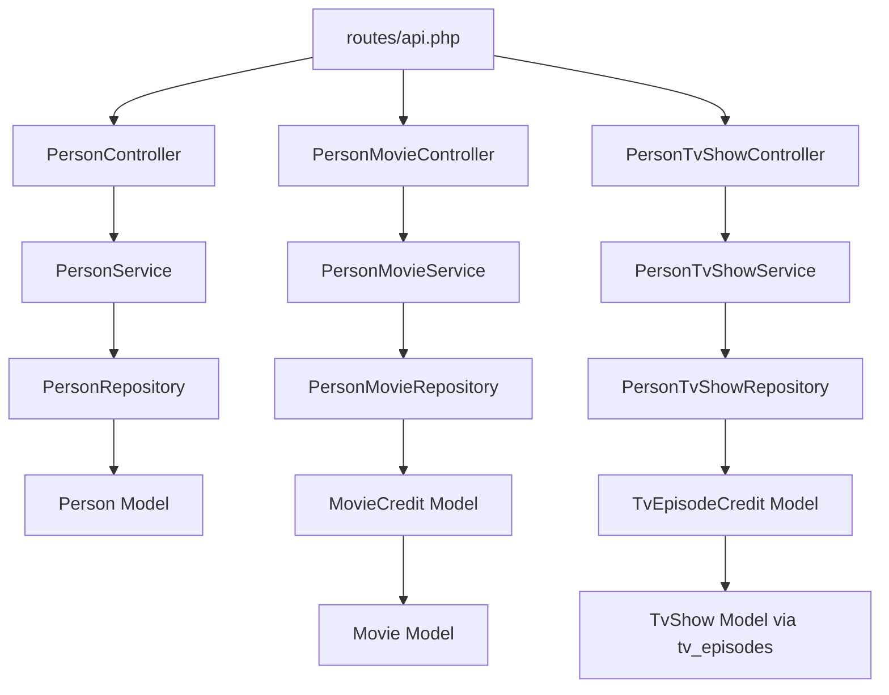

# 技术设计文档：Person 人物模块

## 概述

Person 模块为 Filmly Management Backend 提供人物数据的只读 API，共 4 个接口：

| 接口 | 路由 | 说明 |
|------|------|------|
| 人物列表 | `GET /api/persons` | 分页列表，支持筛选和排序 |
| 人物详情 | `GET /api/persons/{id}` | 单条完整信息 |
| 人物参演电影 | `GET /api/person-movies?person_id={id}` | 通过 movie_credits 关联 |
| 人物参演电视剧 | `GET /api/person-tv-shows?person_id={id}` | 通过 tv_episode_credits 多层关联，去重 |

所有接口均为只读，数据由采集项目写入，本模块不做任何写操作。所有接口需要 `auth:api` 认证。

**关键约束：**
- `persons` 表 500 万+ 条，`per_page` 最大 50，`page` 最大 1000
- `profile_path`、`poster_path` 字段名保持不变，值通过 `ImageHelper::url()` 拼接完整 URL 输出，与项目其他模块一致
- `person_id` 为 NULL 的关联记录直接跳过（不同于 MovieCredit 模块的 null 安全输出）
- tv_shows 关联路径复杂，必须通过子查询或 JOIN 实现，禁止 N+1

---

## 架构

遵循项目标准分层架构：

```
Route → FormRequest → Controller → Service → Repository → Model
```



**设计决策：** `PersonMovieController` 和 `PersonTvShowController` 独立于 `PersonController`，与项目中 `MovieCreditController` 独立于 `MovieController` 的模式保持一致。

---

## 组件与接口

### 新增文件清单

```
app/Models/Person.php
app/Models/MovieCredit.php                    # 已存在，确认关联方法
app/Models/TvEpisodeCredit.php                # 新增（如不存在）
app/Repositories/Contracts/PersonRepositoryInterface.php
app/Repositories/Contracts/PersonMovieRepositoryInterface.php
app/Repositories/Contracts/PersonTvShowRepositoryInterface.php
app/Repositories/PersonRepository.php
app/Repositories/PersonMovieRepository.php
app/Repositories/PersonTvShowRepository.php
app/Services/PersonService.php
app/Services/PersonMovieService.php
app/Services/PersonTvShowService.php
app/Http/Requests/ListPersonRequest.php
app/Http/Requests/ListPersonMovieRequest.php
app/Http/Requests/ListPersonTvShowRequest.php
app/Http/Resources/PersonListResource.php
app/Http/Resources/PersonResource.php
app/Http/Resources/PersonMovieResource.php
app/Http/Resources/PersonTvShowResource.php
app/Http/Controllers/Api/PersonController.php
app/Http/Controllers/Api/PersonMovieController.php
app/Http/Controllers/Api/PersonTvShowController.php
```

### Controller 接口签名

```php
// PersonController
public function index(ListPersonRequest $request): JsonResponse
public function show(int $id): JsonResponse

// PersonMovieController
public function index(ListPersonMovieRequest $request): JsonResponse

// PersonTvShowController
public function index(ListPersonTvShowRequest $request): JsonResponse
```

### Service 接口签名

```php
// PersonService
public function getList(array $filters): LengthAwarePaginator
public function findById(int $id): Person  // 不存在时 throw AppException('人物不存在', 404)

// PersonMovieService
public function getList(int $personId, array $filters): LengthAwarePaginator
// 内部先验证 person 存在，不存在时 throw AppException('人物不存在', 404)

// PersonTvShowService
public function getList(int $personId, array $filters): LengthAwarePaginator
// 内部先验证 person 存在，不存在时 throw AppException('人物不存在', 404)
```

**设计决策：** `PersonMovieService` 和 `PersonTvShowService` 需要验证 person 是否存在，因此注入 `PersonRepositoryInterface` 和各自的 Repository。这与 `MovieCreditService` 不验证 movie 存在的做法不同——需求文档明确要求 person 不存在时返回 404。

### Repository 接口签名

```php
// PersonRepositoryInterface
public function paginateWithFilters(array $filters): LengthAwarePaginator
public function findById(int $id): ?Person
public function existsById(int $id): bool

// PersonMovieRepositoryInterface
public function paginateByPersonId(int $personId, array $filters): LengthAwarePaginator

// PersonTvShowRepositoryInterface
public function paginateByPersonId(int $personId, array $filters): LengthAwarePaginator
```

---

## 数据模型

### Person Model

```php
// app/Models/Person.php
protected $fillable = [];  // 只读表

protected $casts = [
    'gender'     => 'integer',
    'adult'      => 'boolean',
    'birthday'   => 'date',
    'deathday'   => 'date',
    'popularity' => 'double',
    'also_known_as' => 'array',
];
```

### MovieCredit Model（关联方法）

`MovieCredit` 需要定义 `movie()` 关联，用于 `PersonMovieRepository` 的 `with('movie')` 预加载：

```php
public function movie(): BelongsTo
{
    return $this->belongsTo(Movie::class);
}
```

### TvEpisodeCredit Model

```php
protected $fillable = [];  // 只读表

protected $casts = [
    'credit_type' => CreditType::class,
];

// 关联 tv_episodes（用于多层 JOIN）
public function tvEpisode(): BelongsTo
{
    return $this->belongsTo(TvEpisode::class);
}
```

### 图片字段处理

`profile_path`、`poster_path` 字段名保持不变，值通过 `ImageHelper::url()` 拼接完整 URL，与项目其他模块（MovieResource、TvShowResource 等）保持一致。

Resource 层实现：
```php
// PersonListResource
'profile_path' => ImageHelper::url($this->profile_path, 'w185'),

// PersonResource（详情）
'profile_path' => ImageHelper::url($this->profile_path, 'w342'),

// PersonMovieResource（movie 内嵌对象）
'poster_path' => ImageHelper::url($this->movie->poster_path, 'w342'),

// PersonTvShowResource
'poster_path' => ImageHelper::url($this->poster_path, 'w342'),
```

---

## 查询设计

### 1. 人物列表查询（PersonRepository::paginateWithFilters）

```sql
SELECT * FROM persons
WHERE gender = ?          -- 可选
  AND adult = ?           -- 可选
  AND known_for_department = ?  -- 可选
  AND name LIKE 'q%'      -- 可选，前缀匹配
ORDER BY {sort} {order}   -- 白名单校验，默认 id DESC
LIMIT 50 OFFSET ?         -- per_page 最大 50
```

允许排序字段白名单：`['id', 'popularity', 'updated_at', 'created_at']`

### 2. 人物参演电影查询（PersonMovieRepository::paginateByPersonId）

```sql
SELECT mc.*
FROM movie_credits mc
WHERE mc.person_id = ?    -- 只查 person_id 非 NULL 的记录（WHERE 条件自然过滤 NULL）
ORDER BY mc.id DESC
LIMIT ? OFFSET ?
```

通过 `with('movie')` 预加载电影信息，避免 N+1。`movie_credits.person_id = ?` 的 WHERE 条件天然过滤了 NULL 值（NULL != 任何值）。

### 3. 人物参演电视剧查询（PersonTvShowRepository::paginateByPersonId）

这是最复杂的查询，需要三层关联并去重：

```sql
SELECT DISTINCT ts.*
FROM tv_shows ts
INNER JOIN tv_episodes te ON te.tv_show_id = ts.id
INNER JOIN tv_episode_credits tec ON tec.tv_episode_id = te.id
WHERE tec.person_id = ?   -- 只查 person_id 非 NULL 的记录
ORDER BY ts.id DESC
LIMIT ? OFFSET ?
```

**设计决策：使用 JOIN + DISTINCT 而非子查询**

- `DISTINCT` 在 `tv_shows` 层去重，每部剧只返回一条
- `tec.person_id = ?` 的 WHERE 条件自然过滤 NULL 值
- 禁止在应用层循环查询（N+1）

**分页注意事项：** `DISTINCT` + `paginate()` 在 Laravel 中需要使用 `->paginate()` 前先 `->distinct()`，或使用子查询包装。推荐方式：

```php
$query = TvShow::query()
    ->join('tv_episodes', 'tv_episodes.tv_show_id', '=', 'tv_shows.id')
    ->join('tv_episode_credits', 'tv_episode_credits.tv_episode_id', '=', 'tv_episodes.id')
    ->where('tv_episode_credits.person_id', $personId)
    ->select('tv_shows.*')
    ->distinct();

return $query->paginate(perPage: ..., page: ...);
```

Laravel 的 `paginate()` 在有 `distinct()` 时会自动生成正确的 `COUNT(DISTINCT ...)` 子查询。

---

## 正确性属性

*属性是在系统所有有效执行中都应成立的特征或行为——本质上是关于系统应该做什么的形式化陈述。属性是人类可读规范与机器可验证正确性保证之间的桥梁。*

### 属性 1：movie_credits 过滤不包含 NULL person_id 记录

*对于任意* 合法的 `person_id`，`PersonMovieRepository::paginateByPersonId` 返回的所有 `movie_credits` 记录，其 `person_id` 字段都应等于传入的 `person_id`，不包含 `person_id` 为 NULL 的记录。

**验证：需求 5.4**

### 属性 2：tv_shows 结果去重

*对于任意* 合法的 `person_id`，`PersonTvShowRepository::paginateByPersonId` 返回的所有 `tv_show` 记录，其 `id` 字段在单次分页结果中应唯一（无重复 tv_show）。

**验证：需求 6.4、6.5**

---

## 错误处理

| 场景 | 处理方式 | 响应 |
|------|---------|------|
| 未携带或无效 JWT Token | `auth:api` middleware 拦截 | `code: 401` |
| FormRequest 验证失败 | Laravel 全局异常处理 | `code: 422` |
| `persons/{id}` 不存在 | `PersonService::findById` 抛出 `AppException` | `code: 404, message: "人物不存在"` |
| `person-movies` 的 person_id 不存在 | `PersonMovieService::getList` 抛出 `AppException` | `code: 404, message: "人物不存在"` |
| `person-tv-shows` 的 person_id 不存在 | `PersonTvShowService::getList` 抛出 `AppException` | `code: 404, message: "人物不存在"` |
| 未捕获异常 | 全局异常处理 | `code: 500` |

异常抛出方式（遵循项目规范，不在 Controller/Service 中 try-catch）：

```php
// PersonService::findById
$person = $this->repository->findById($id);
if ($person === null) {
    throw new AppException('人物不存在', 404);
}

// PersonMovieService::getList
if (!$this->personRepository->existsById($personId)) {
    throw new AppException('人物不存在', 404);
}
```

---

## 测试策略

本模块为只读接口，测试使用 mock Service / mock Repository，不依赖真实数据库。

### Feature Test（主要）

位置：`tests/Feature/Persons/`

**PersonListTest：**
- `test_unauthenticated_request_returns_401`
- `test_returns_paginated_person_list`
- `test_per_page_exceeding_50_returns_422`
- `test_page_exceeding_1000_returns_422`
- `test_invalid_gender_returns_422`（gender=4）
- `test_invalid_adult_returns_422`（adult=2）
- `test_invalid_sort_field_returns_422`
- `test_profile_path_contains_full_image_url`（验证 profile_path 包含 `image.tmdb.org`）
- `test_default_sort_is_id_desc`

**PersonDetailTest：**
- `test_unauthenticated_request_returns_401`
- `test_returns_person_detail`
- `test_returns_404_when_person_not_found`
- `test_birthday_deathday_format_is_y_m_d`
- `test_timestamps_format_is_iso8601_utc`
- `test_profile_path_contains_full_image_url`

**PersonMovieTest：**
- `test_unauthenticated_request_returns_401`
- `test_person_id_required`
- `test_returns_404_when_person_not_found`
- `test_returns_paginated_movie_list`
- `test_per_page_exceeding_100_returns_422`
- `test_movie_poster_path_contains_full_image_url`
- `test_default_sort_is_id_desc`

**PersonTvShowTest：**
- `test_unauthenticated_request_returns_401`
- `test_person_id_required`
- `test_returns_404_when_person_not_found`
- `test_returns_paginated_tv_show_list`
- `test_per_page_exceeding_100_returns_422`
- `test_tv_show_poster_path_contains_full_image_url`

### Unit Test（按需）

位置：`tests/Unit/Repositories/`

由于 tv_shows 关联查询逻辑复杂，可为 `PersonTvShowRepository` 编写单元测试，使用 SQLite in-memory 验证 DISTINCT 去重和 JOIN 逻辑的正确性（需要手动建表）。

### 属性测试说明

属性 1 和属性 2 在 Feature Test 层通过 mock 验证：
- 属性 1：mock `PersonMovieRepository::paginateByPersonId`，验证其 WHERE 条件包含 `person_id = ?`（非 NULL 过滤由 SQL 语义保证）
- 属性 2：在 Unit Test 中使用 SQLite in-memory，插入同一 person 参演同一 tv_show 多集的数据，验证返回结果中 tv_show 不重复

### 测试覆盖要求

| 场景 | 测试类型 |
|------|---------|
| 未认证返回 401 | Feature Test（必须） |
| 参数验证失败返回 422 | Feature Test（必须） |
| 正常请求返回正确结构 | Feature Test（必须） |
| 资源不存在返回 404 | Feature Test（必须） |
| per_page 大表限制（≤50） | Feature Test（必须） |
| profile_path/poster_path 输出完整图片 URL | Feature Test（必须） |
| tv_shows 去重正确 | Unit Test（必须） |
| 时间字段格式正确 | Feature Test（必须） |
